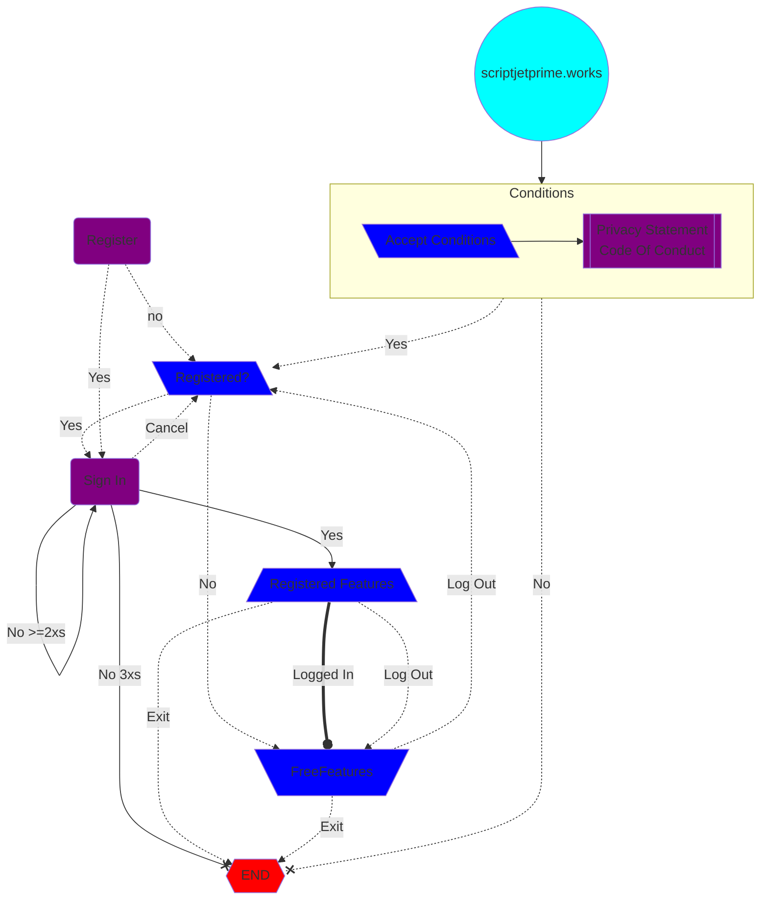

<<<<<<< HEAD
# scriptjetPrime.works Flow

```mermaid
flowchart TD
    classDef fEnd fill:blue
    classDef bEnd fill:purple
    classDef dec fill:orange
    classDef END fill:red
    classDef Start fill:Cyan

    A((scriptjetprime.works)):::Start-->Conditions
    
    subgraph Conditions
        B1[\Accept Conditions\]:::fEnd-->B2[[Privacy Statement</br> Code Of Conduct]]:::bEnd
    end

    Conditions-.->|Yes|C[\Registered?\]:::fEnd
    Conditions-.-x|No|H
    C-.->|No|F[\FreeFeatures/]:::fEnd
    C-.->|Yes|D(Sign In):::bEnd    
    E(Register):::bEnd-.->|Yes|D
    E-.->|no|C
    D-->|Yes|G[/Registered Features\]:::fEnd
    D-->|No >=2xs|D
    D--x|No 3xs|H
    D-.->|Cancel|C
    G===o|Logged In|F
    G-.->|Log Out|F
    G-.->|Exit|H
    F-.->|Exit|H
    F-.->|Log Out|C
    H{{END}}:::END
```