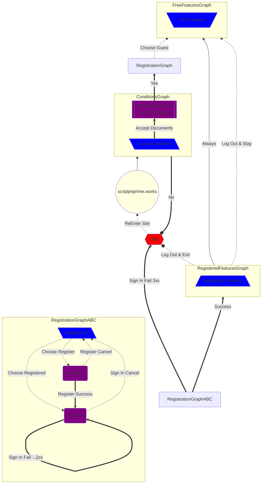

# scriptjetPrime.works Flow

```mermaid
flowchart BT
    classDef fEnd fill:blue
    classDef bEnd fill:purple
    classDef dec fill:orange
    classDef END fill:red
    classDef Start fill:lightYellow

    A((scriptjetprime.works)):::Start
    B[\Registered?\]:::fEnd
    C(Sign In):::bEnd
    D[\Free Features/]:::fEnd
    E(Register):::bEnd
    F[/Registered Features\]:::fEnd
    G1[\Accept Conditions\]:::fEnd
    G2[[Privacy Statement</br> Code Of Conduct]]:::bEnd
    H{{END}}:::END


    A-->ConditionsGraph
    C-.->|Sign In Cancel|B
    RegistrationGraph-.->|Choose Guest|FreeFeaturesGraph
    G2==>|Yes|RegistrationGraph
    RegisteredFeaturesGraph--->|Always|FreeFeaturesGraph    
    ConditionsGraph==o|No|H
    RegistrationGraphABC==>|Success|RegisteredFeaturesGraph
    RegistrationGraphABC==x|Sign In Fail 3xs|H
    RegisteredFeaturesGraph-.->|Log Out & Stay|FreeFeaturesGraph
    RegisteredFeaturesGraph-.-o|Log Out & Exit|H
    H-.->|ReEnter Site|A

    subgraph ConditionsGraph
        G1==>|Accept Documents|G2
    end

    subgraph RegistrationGraphABC   
        C==>|Sign In Fail ...2xs|C  
        B-.->|Choose Register|E
        B-.->|Choose Registered|C      
        E==>|Register Success|C
        E-.->|Register Cancel|B           
    end

    subgraph FreeFeaturesGraph
        D
    end

    subgraph RegisteredFeaturesGraph
        F
    end


```